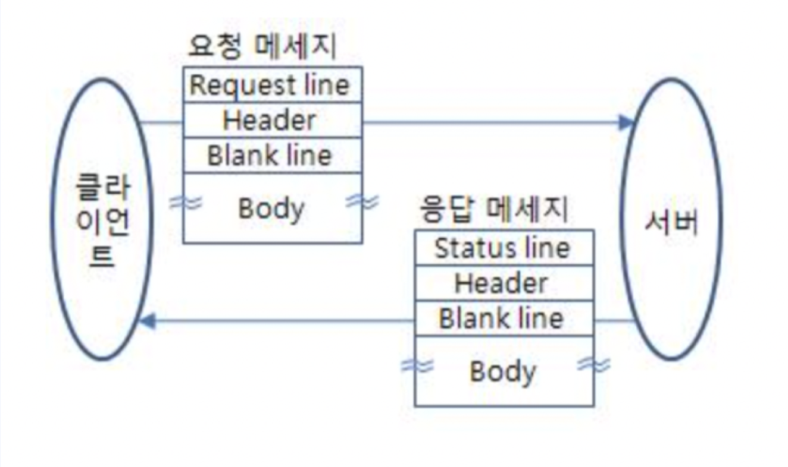

## Http 프로토콜의 이해

### Http란?

- 서버와 클라이언트가 데이터를 주고받기 위한 프로토콜(규약)
 

- HTTP/1.1 , HTTP/2는 TCP 기반 위에서 동작
- HTTP/3는 UDP 기반 위에서 동작

## Http의 요청/응답구조

## 특징

#### 클라이언트-서버 모델

#### 무상태 프로토콜(Stateless)

- 서버가 클라이언트 상태를 유지하지 않음
- 해결책 : Keep-Alive 속성 사용

 

####  비 연결성(Connectionless)

- 서버가 클라이언트 요청에 대해 응답을 마치면 맺었던 연결을 끊어 버림
- 해결책 : 쿠키(클라이언트에 정보 저장), 세션(서버에 정보 저장), JWT

## 기타

#### HTTP 요청 메소드

- GET, POST, PUT, DELETE 등 HTTP 응답 코드

- 2xx(성공), 3xx(리다이렉션), 4xx(클라이언트 에러), 5xx(서버 에러) 등 HTTP 헤더

- Content-type, Accept, Cookie, Set-Cookie, Authorization 등