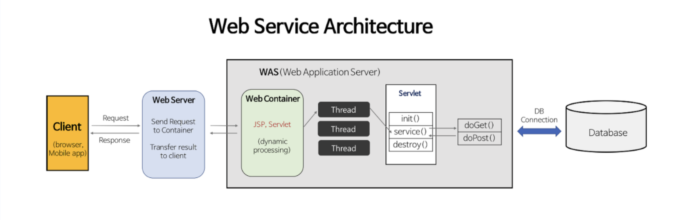

## Servlet (Server + Applet의 합성어)

- 자바에서 웹 애플리케이션을 만드는 기술
- 자바에서 동적인 웹 페이지를 구현하기 위한 표준

## Servlet 인터페이스

- 서블릿 컨테이너가 서블릿 인터페이스에 있는 메소드들을 호출함

- 서블릿 생명주기와 관련된 메소드
- init(), service(), destroy() -> 생성시 초기화, client 요청시 호출, 컨테이너 종료시 호출

- 서블릿 기타 메소드
- getServletConfig(), getServletInfo() -> 초기 설정 정보를 담은 객체 반환, Servlet 정보 반환

## ServletContainer

- 서블릿의 (라이프사이클을 관리하는 역할) -> container
- 서블릿 컨테이너는 웹 서버와 소켓을 만들고 통신하는 과정을 대신 처리해주어 개발 자는 비즈니스 로직에만 집중하면 된다.
- 서블릿 객체를 싱글톤으로 관리 (인스턴스 하나만 생성하여 공유하는 방식) -> stateful(상태 유지)하게 설계하면 안됨

## WAS vs 서블릿 컨테이너

- WAS는 서블릿 컨테이너를 포함하는 개념
- WAS는 매 요청마다 스레드 풀에서 기존 스레드를 사용함
- WAS의 주요 튜닝 포인트는 max thread 수
- 대표적인 WAS로는 톰캣이 있다.

